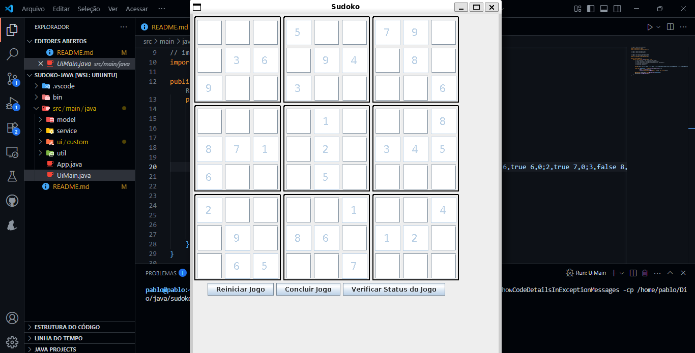

# Projeto Java criando um jogo de sudoku

Este projeto é um jogo de Sudoku desenvolvido em Java, com interface gráfica baseada em `JPanel` e `JFrame`. Utiliza princípios de Programação Orientada a Objetos para garantir modularidade, reutilização de código e fácil manutenção.

## Funcionalidades

- Interface gráfica intuitiva para jogar Sudoku
- Validação automática das regras do Sudoku
- Geração de novos tabuleiros
- Possibilidade de reiniciar o jogo

## Tecnologias Utilizadas

- Java SE
- Swing (`JPanel`, `JFrame`)

## Estrutura do Projeto

```
sudoku-java/
├── src/main/java/
│   ├── model/
│   ├── service/
│   ├── ui/
│   ├── util/
│   ├── Main.java   // Jogo no terminal
│   ├── UIMain.java // Jogo com Interface gráfica
├── README.md
└── ...
```

## Tela do Jogo Sudoku

